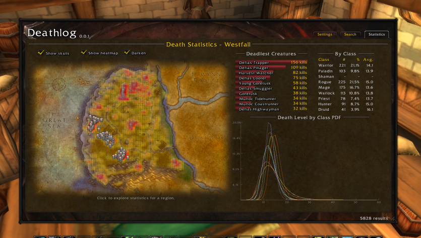
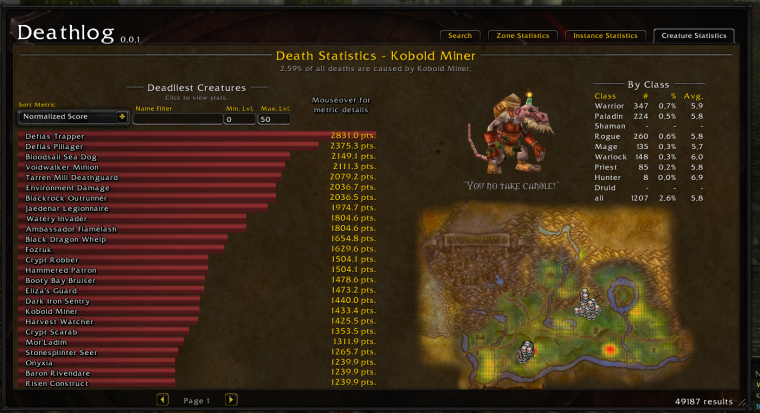
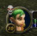

# Deathlog

A WoW Era Hardcore addon which provides a ui for exploring the deathlog and death statistics. __NOTE__ I am currently looking for more deathlog data! Please consider reaching out (discord lakai.#2409) to share your deathlog data.  Current 96k entries, goal 500k.

**[SEE WIKI FOR OFFLINE STATS](https://github.com/aaronma37/Deathlog/wiki)**  The wiki will be updated as the database grows

*Feel free to use the database for any purpose!* [Database 96k](https://github.com/aaronma37/Deathlog/tree/master/db/db.json)

## Compatibility

This addon is completely safe to run alongside the `Hardcore` addon.  Alternatively, this addon can be run without the Hardcore addon running, however, it does not provide verification for the solo self-found challenge.

## Features

### Faction-wide Death notification compatibility with the Hardcore addon
* Emits notifications when your character dies
* Receives and records incoming death notifications
* Can be set to guild only

### Highly customizable Death Alerts

### Browse the Deathlog
* Search by name, level, class, race, etc..

### Deathlog Statistics per Zone

* Fully functional map with heatmap overlay and death location overlays
* List of deadliest creatures for each Zone
* Death statistics by class list and probability density function graph

### Deathlog Statistics per Instance

* View death stats per instance.  (WIP Needs more data)

### Deathlog Statistics by NPC/Creature

* See what creatures do the most killing in Azeroth. Normalized and total kill ranking
* Creature locations and models

### Customizable Deathlog (minilog widget)

* Configure columns of the deathlog
* Configure font of the deathlog

### Heatmap Indicator

* Skull icon which turns red when the player is in a dangerous area

### Heatmap WorldMap Overlay

* Open the world map to see an overlay of dangerous areas

### Preprocessed collection

* Over 96k deathlog entries used for statistics page
* The file `collected_entries.lua` can be referenced for all entries.  This file isn't actually loaded and is included for sharing.

### Tooltip Information

* View deadly ranking in npc hover over tooltip

