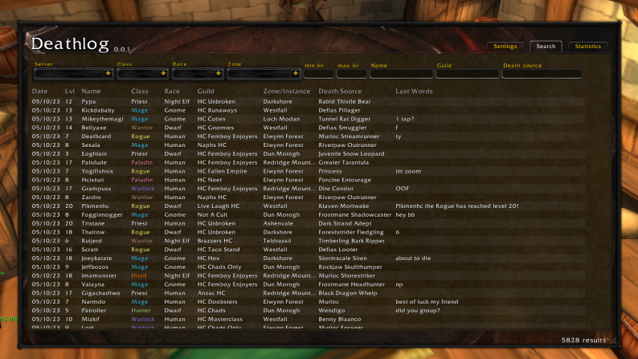

# Deathlog

A WoW Era Hardcore addon which provides a ui for exploring the deathlog and death statistics.

## Work-in-Progress
* Widgets haven't been created yet.
* Not yet hooked up to deathlog chat channel.  Until then, this imports the Hardcore addon deathlog data.

## Compatibility

This addon is completely safe to run alongside the `Hardcore` addon.  Alternatively, this addon can be run without the Hardcore addon running, however, it does not provide verification for the solo self-found challenge.

## Features

### Faction-wide Death notification compatibility with the Hardcore addon
* Emits notifications when your character dies
* Receives and records incoming death notifications
* Can be set to guild only

### Browse the Deathlog
* Search by name, level, class, race, etc..

### Deathlog Statistics per Zone

* Fully functional map with heatmap overlay and death location overlays
* List of deadliest creatures for each Zone
* Death statistics by class list and probability density function graph

### Preprocessed collection

* Over 32k deathlog entries used for statistics page
* The file `collected_entries.lua` can be referenced for all entries.  This file isn't actually loaded and is included for sharing.

### Widgets
Under construction

#### Deathlog widget

* Similar functionality to the Hardcore deathlog widget with some modified UI

#### Death Alerts

* Similar functionality to the Hardcore death alerts widget with some modified UI

#### Danger notifications

* Visual indicators for when your character is nearby dangerous coordinates

#### Tooltip information

* Indicate number of hardcore kills that the target/hover over unit has
